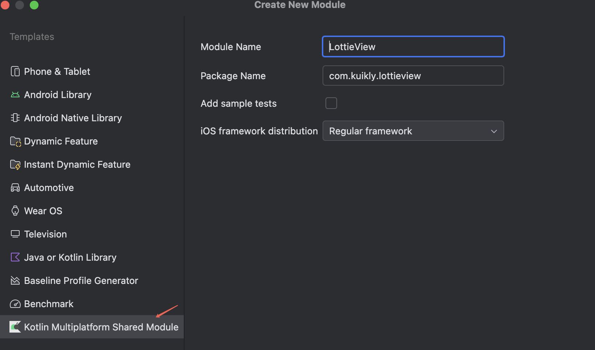
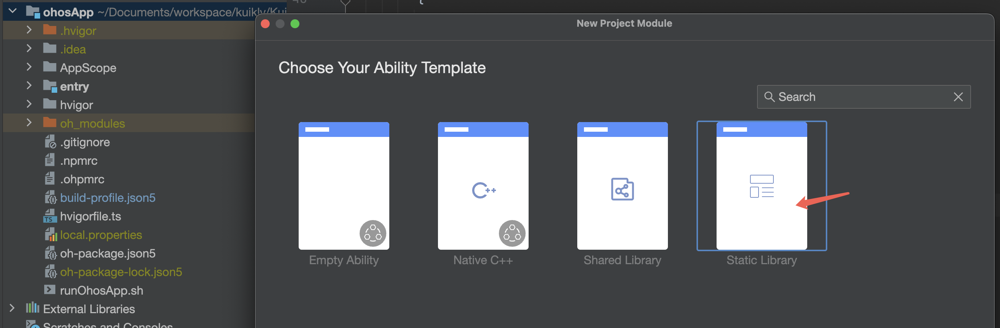
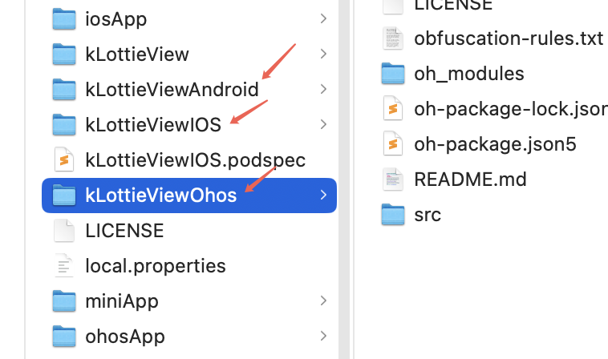

# Kuikly扩展库创建指引
在实际业务开发中, 如果你扩展的Kuikly View和Module是业务无关的，你可以把它们发布为独立的Kuikly扩展库,
供自身或者其他业务共享使用。 下面我们以扩展一个自定义LottieView组件为例，来学习如何创建Kuikly扩展库。

## 实现思路
通常情况，按照Kuikly扩展原生View和Module的文档步骤，我们会分别在Kuikly侧按照标准接口实现跨端层逻辑，在各宿主平台侧实现对应的平台侧标准接口，
并注册到各平台侧Render。这种方式不利于组件的多业务共享，多业务集成也不方便。

Kuikly扩展库的实现，整体与Kuikly扩展View和Module一致，区别是将Kuikly侧和平台侧以独立Module方式，包装在一个独立工程下，
以能实现Kuikly侧、各平台侧的源码能独立打包、独立发布。

以社区[Lottie组件](https://github.com/walkman707/KuiklyLottie)为例，以下是Kuikly扩展库的工程组织结构：

```shell
.
├── androidApp
├── h5App
├── iosApp
├── kLottieView // LottieView跨端侧实现
├── kLottieViewAndroid // LottieView 安卓端实现
├── kLottieViewIOS // LottieView iOS端实现
├── kLottieViewIOS.podspec
├── kLottieViewOhos // LottieView Ohos端实现
├── miniApp
├── ohosApp
└── shared // 跨端Demo模块

```

## 创建Kuikly库工程
按照上述组件库工程结构，我们需要创建以下工程和模块：
* Kuikly模板工程
* KMP跨端工程：kLottieView模块
* 安卓平台侧实现：kLottieViewAndroid模块
* iOS平台侧实现：kLottieViewIOS模块
* Ohos平台侧实现：kLottieViewOhos模块

1. **创建Kuikly模板工程**

    使用Android Studio新建 Kuikly 模板工程。 File -> New -> New Project -> Kuikly Project Template


2. **KMP跨端工程kLottieView模块**

    **新增KMP跨端模块有两种方式：**

    **方式1**：通过Android Studio Import Module创建。File -> New -> Import Module

这种方式生成后，需要参考模板工程shared模块，对工程构建脚本build.gradle.kt进行配置。

    <br>**方式2**：直接Copy 模板工程的shared模块 
<br>本文档采用方式2进行介绍。

    拷贝shared模块后，需要对build.gradle.kts和build.ohos.gradle.kts和shared.podspec脚本进行修改，主要修改点如下，具体可参考kLottieView的模块实现：

    **build.gradle.kts**：
   * 引入插件
   
       ```shell
       plugins {
           kotlin("multiplatform")
           kotlin("native.cocoapods")
           id("com.android.library")
           id("com.google.devtools.ksp") // 可选。如果不构建JS Target，可删
           id("maven-publish")
           id("com.tencent.kuikly-open.kuikly") // 可选。如果不构建JS Target，可删
       }
       ```
   
   * js(IR)  Target配置：
    <br>如果不构建JS Target，可删
   * cocoapods配置： 
   <br>baseName名称修改为新的名字，一般取跨端模块的名称，如baseName = "kLottieView"。其他字段根据需要修改。

   * 删除androidMain依赖配置
   <br>本组件无androidMain依赖，可删除：api("com.tencent.kuikly-open:core-render-android:${Version.getKuiklyVersion()}")
   * 其他
   <br>无JS Target构建，以下闭包可删除
   ```shell
   ksp{...}
   dependencies {...}
   configure<KuiklyConfig> {...}
   ```

   <br>**build.ohos.gradle.kts**
   除上述build.gradle.kts修改外，build.ohos.gradle.kts需在kotlin闭包，额外增加ohos target配置：
    ```shell
    kotlin {
        ...
        ohosArm64 {
            binaries.sharedLib {
            }
        }
        ...
    }
    
    ```
    同时可以移除Android、iOS Target配置

    <br>**shared.podspec修改**

    文件名修改：修改文件名修改为对应的模块名，如kLottieView
    <br>脚本内容修改：整体将shared替换为对应的模块名（和上述cocoapods闭包配置的baseName一致），如kLottieView
其他配置，可按需修改

    <br>**添加Module**

    将复制后的kLottieView Module，添加到settings.gradle.kts和settings.ohos.gradle.kts
    ```shell
    include(":kLottieView")
    ```

3. **安卓平台侧：kLottieViewAndroid模块**

    在Android Studio 创建安卓平台Module。File -> New -> New Module -> Android Library，模块命名为kLottieViewAndroid

    在androidAPP添加对kLottieViewAndroid的依赖
    ```shell
    implementation(project(":kLottieViewAndroid"))
    ```
4. **iOS平台侧实现：kLottieViewIOS模块**

    iOS平台kLottieViewIOS模块，可直接通过创建一个kLottieViewIOS目录来添加iOS平台侧扩展View实现。

    创建kLottieViewIOS模块的kLottieViewIOS.podspec，具体参考源码实现。

    在iosApp Podfile 添加对kLottieViewIOS的依赖
    ```shell
    pod 'kLottieViewIOS', :path => '../'
    ```

5. **Ohos平台侧实现kLottieViewOhos模块**

    在DevEco IDE，打开ohosApp工程 创建Static Library：kLottieViewOhos


    移动kLottieViewOhos目录到根目录（可选）：

    在ohosApp工程创建的kLottieViewOhos是在ohosApp目录下。为了保持各平台实现目录结构一致，可将kLottieViewOhos目录移动到与kLottieViewAndroid和kLottieViewIOS模块同一级目录。


    移动kLottieViewOhos目录后，需更新ohosApp对kLottieViewOhos依赖的Path
    ```shell
    // 根目录build-profile.json5
    ...
        {
          "name": "kLottieViewOhos",
          "srcPath": "../kLottieViewOhos"
        }
    ...
    
    // entry目录下oh-package.json5
      "dependencies": {
    ...
        "@walkman707/kLottieViewOhos": "file:../../kLottieViewOhos",
    ...
      }
    
    ```

## 编写跨平台逻辑
新建完工程后, 我们开始编写暴露给Kuikly的跨平台接口逻辑。具体参考kLottieView模块源码实现
<br>为了在开发过程中，测试kLottieView模块编译。可在模版工程shared模块添加对kLottieView的依赖
```shell
    sourceSets {
        val commonMain by getting {
            dependencies {
            ...
                implementation(project(":kLottieView"))
            ...
            }
        }
    }

```
这样，就可以通过IDE 运行androidApp、iosApp、ohosApp来方便的验证kLottieView模块编译。

## 实现kLottieView组件在各个平台的逻辑
* 在Android平台实现
具体参考kLottieViewAndroid模块源码
* 在iOS平台实现
具体参考kLottieViewIOS模块源码
* 在Ohos平台实现
具体参考kLottieViewOhos模块源码

## 集成验证
集成验证，仅需将各平台侧View注册到各平台Render，将其暴露给Kuikly侧，实现Kuikly侧和各平台侧逻辑连接。
* Android侧注册
    ```shell
        override fun registerExternalRenderView(kuiklyRenderExport: IKuiklyRenderExport) {
            super.registerExternalRenderView(kuiklyRenderExport)
            with(kuiklyRenderExport) {
                renderViewExport(AndroidLottieView.COMPONENT_NAME, { context ->
                    AndroidLottieView(context)
                })
            }
        }
    
    ```
* iOS侧注册
<br>iOS侧的kuikly组件是通过运行时暴露给Kuikly侧，因此无需手动注册

* Ohos侧注册
    ```shell
    export class KuiklyViewDelegate extends IKuiklyViewDelegate {
      getCustomRenderViewCreatorRegisterMap(): Map<string, KRRenderViewExportCreator> {
        const map: Map<string, KRRenderViewExportCreator> = new Map();
        map.set(KRMyView.VIEW_NAME, () => new KRMyView());
        map.set(KTLottieViewImpl.VIEW_NAME, () => new KTLottieViewImpl)
        return map;
      }
    }
    
    ```

## 发布产物
Kuikly扩展库需要对各Module进行独立发布。

1. Kuikly侧跨端模块：
<br>在kLottieView模块的build.gradle.kts、build.ohos.gradle.kts脚本增加发布配置。
    ```shell
    plugins {
    ...
        // 引入maven-publish插件
        id("maven-publish")
        signing
    ...
    }
    //配置发布产物的group和version信息
    version = MavenConfig.VERSION
    group = MavenConfig.GROUP
    
    // 发布配置
    publishing {
        repositories {
            val username = MavenConfig.getUsername(project)
            val password = MavenConfig.getPassword(project)
            if (username.isNotEmpty() && password.isNotEmpty()) {
                maven {
                    credentials {
                        setUsername(username)
                        setPassword(password)
                    }
                    url = uri(MavenConfig.getRepoUrl(version as String))
                }
            } else {
                mavenLocal()  // 发布到mavenLocal
                // 发布到build/repo目录
    //            maven {
    //                url = uri(layout.buildDirectory.dir("repo"))
    //            }
            }
            publications.withType<MavenPublication>().configureEach {
                pom.configureMavenCentralMetadata()
                signPublicationIfKeyPresent(project)
            }
        }
    }
    
    ```
    <br>执行发布脚本：
    <br>Android/iOS产物发布： ./gradlew :kLottieView:publish
    <br>Ohos产物发布：./gradlew -c settings.ohos.gradle.kts :kLottieView:publish
    <br>因为这种发布是对KPM产物区分平台两次发布，所以发布上要做以下区分：
   * Ohos的产物Version要和Android和iOS区分，比如在Android/iOS发布上版本增加_ohos后缀
   * build.ohos.gradle.kts要删除对Android和iOS编译目标的配置，否则会重复发布。


2. Android平台侧模块：
<br>参考kLottieViewAndroid模块，增加和修改publish.gradle，并在build.gradle.kts中引入：
    ```shell
    apply(from = "./publish.gradle")
    
    ```
    执行./gradlew :kLottieViewAndroid:publish命令发布


3. iOS平台侧模块：
<br>iOS平台产物发布到CocoaPods，可参考三方社区[制作组件库上传到CocoaPods](https://developer.aliyun.com/article/1142241)实践分享。


4. Ohos平台侧模块：
<br>鸿蒙平台产物发布，可参考[Ohpm官方发布指引](https://ohpm.openharmony.cn/#/cn/help/createandpublish)，也可以参考三方社区[鸿蒙发布实践](https://juejin.cn/post/7419869992617918504)分享。
