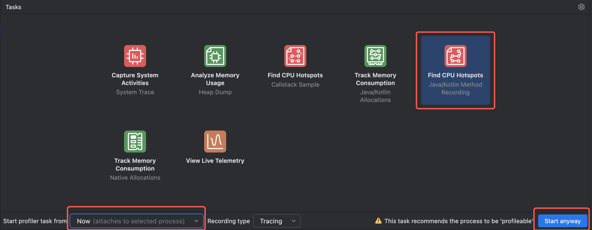
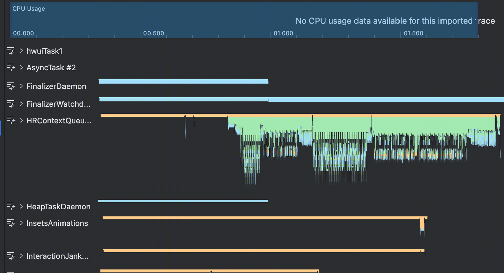
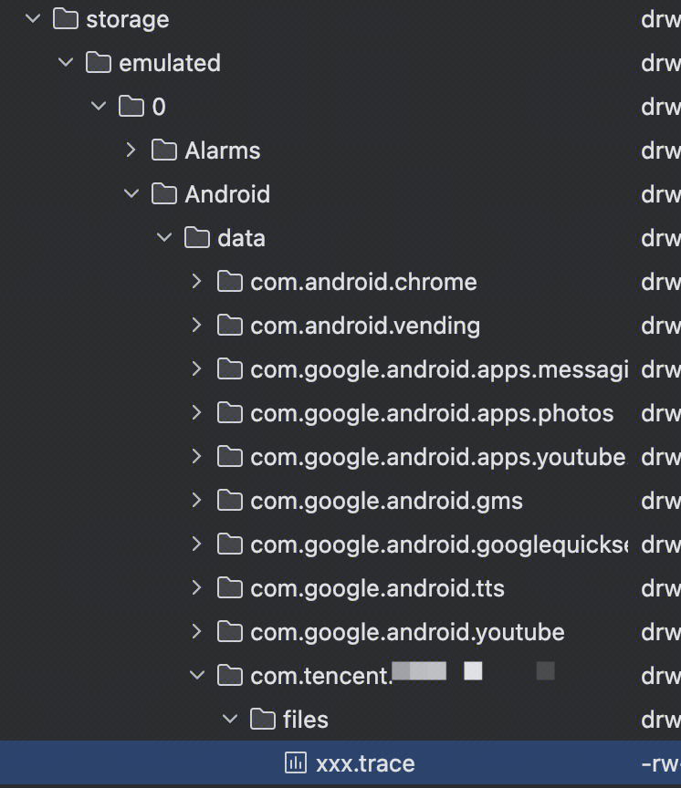
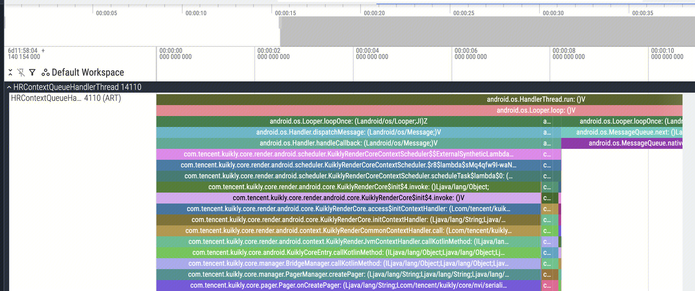
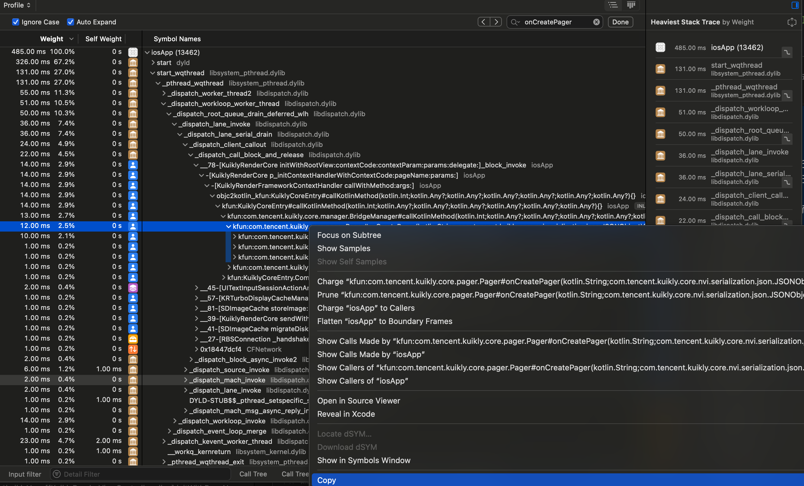
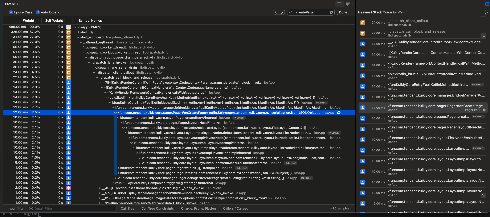
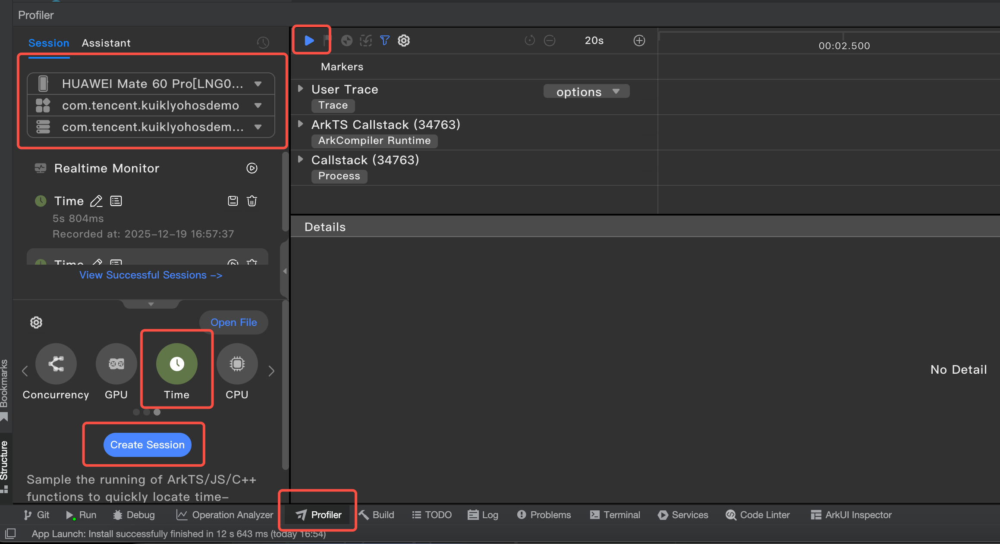
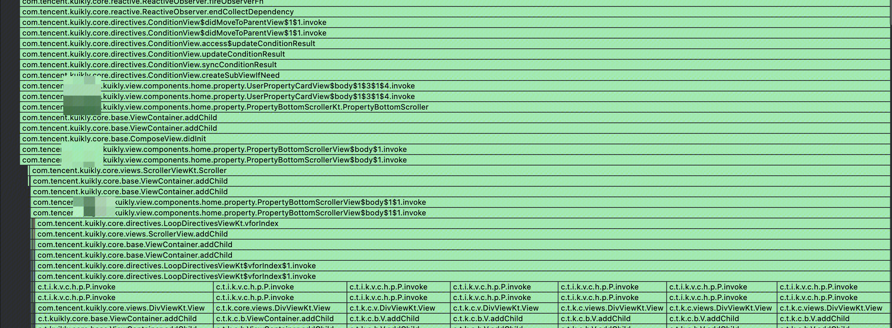

# Kuikly页面启动性能分析指引

## **1. 背景**

部分接入Kuikly的业务希望进一步优化启动耗时，以及进行相关性能分析。针对这类启动性能问题本文将介绍一些初步分析及排查的思路。

## **2. 分析概述**

经过我们内部测试验证以及已有接入业务线上使用来看，只要正常使用，不存在框架问题导致影响启动性能情况。

如果出现相关耗时增长，很大概率是因为业务逻辑的不正常使用(如：数据读取加载阻塞UI创建、UI层级过于复杂且一次加载过多等）

## **3. 排查工具**

### Performance API  [启动耗时指标说明](https://kuikly.tds.qq.com/API/modules/performance.html#指标1-启动耗时)

记录页面启动到首帧渲染完成，各个阶段的耗时，可以使用进行初步的耗时记录

### 关键函数打点

对于一些觉得耗时的操作，可以进行打点耗时记录影响。

注：此处打点耗时建议 println(当前时间戳) ，避免相关Log异步后输出非实际的时间戳

### Android Profile工具

对于一些页面启动后或完整的流程记录，可以使用 `Profile` 工具进一步分析

`Androdi Studio`上提供了可以`trace`的工具，可以在页面打开前启动，并在内容显示后结束

`HRContenxtQueueHandlerThread`为`Kuikly`线程，可以看到在启动过程执行了什么任务，是否有任务影响耗时。


<div align="center">

</div>
<div align="center">

</div>

如果业务过程比较复杂，`Trace`过程太久导致文件过大,可能出现`Android Studio`打不开的情况，这类情况可以采取以下措施：

使用代码进行`Trace`文件记录，`Debug.startMethodTracing(fileName, bufferSize)` `Debug.stopMethodTracing()` 在代码需要关注的时间节点前后使用，最终`trace`文件会默认生成对应的目录，文件过大可以使用一些第三方工具进行打开，如：https://ui.perfetto.dev/
<div>

</div>



对于复杂的流程，建议先初步打点观察，后再对一些关键步骤进行`trace`的进一步分析

在Kuikly代码内，可以通过 `expect` 函数的接口并在 `AndroidMain` 实现 `trace` 函数的记录

```kotlin
// CommonMain
expect fun debugStart(fileName: String)
expect fun debugStop()

// androidMain

import android.os.Debug

actual fun debugStart(fileName: String) {
    val bufferSize = 1000 * 1024 * 1024; // 适当调大buffer
    Debug.startMethodTracing(fileName, bufferSize);
}

actual fun debugStop() {
    Debug.stopMethodTracing()
}

// 使用
debugStart("xxx")

debugStop()
```

### iOS Profile工具

在iOS平台上，如果希望页面代码耗时有详细的了解，可以利用instrument工具进行分析。

用Xcode打开iosApp.xcworkspace工程后，选中target（如iosApp）和设备后，通过`Command-I (⌘I) `快捷键或者`Product`-`Profile`菜单执行Profiling操作，并在随后的Instrument面板中选择`Time Profiler`；
随即Profiler启动，页面启动完或执行完业务期望的操作后，可点击工具栏按钮停止Profiler。

这时在Instruments中就记录好了callstack以及耗时信息，默认符号未还原，所以在开始分析前，还需要通过选中业务帧，点击右键，在出现的菜单中点击`Lcate dSYM...`关联符号。
<div>

</div>

关联符号后在函数耗时基础上可看到完整的符号,及其对应的文件、行号信息
<div>

</div>


### 鸿蒙 Profile工具

在鸿蒙平台上，如果希望页面代码耗时有详细的了解，可以利用Profiler工具进行分析。

用鸿蒙IDE加载工程跑起来后，点选底部的`Profiler`面板，选择设备、App进程，选中`Time`或者`Launch` Profiler，点击Create，然后点击小三角形启动Profiler。

<div>

</div>

启动页面或者执行完预期中的操作后，点击停止按钮。
这时选中Callstack泳道即可浏览堆栈调用以及耗时情况，并可以看到完整的符号信息。
双击堆栈行可自动打开对应的Kotlin源文件。
<div>

</div>


## **4. 实际业务用例**

用例A：

业务部分代码块：
```
val data = initHomeData()
performTaskWhenRenderViewDidLoad {           
	saveCache(data)
	firstLoadEnd = true
	preloadSecondPage()
}
```

背景：在首屏加载过程中，会请求数据，并在数据到来后，希望使用 `performTaskWhenRenderViewDidLoad` 异步缓存数据，但发现过程中会白屏阻塞一段时间。

分析：页面对 `trace` 分析发现，发现缓存数据的操作并没有按照预期在下一个时间片执行， 并且缓存存储采用的是同步方法，数据量也比较大，缓存数据过程阻塞了相关UI的创建。

原因：使用`performTaskWhenRenderViewDidLoad` 是在 `renderView` 还没创建的时候才有效，但在使用过程中`renderView`已经创建，所以并没有按照预期在下个时间片执行。

解决方案：

- 使用 `addNextTickTask` 或者在相关的 View 的回调在进行缓存存储，避免影响视图的创建和加载。


用例B：

业务B发现数据回包，更新`observable`过程耗时比较长，由于业务复杂，不确定此过程的相关操作，并期望有相关优化空间

```
println(t1)

observableA = newValue

println(t2)
```

做法：

对该`observable`的前后进行`trace`操作

```
debugStart("updateValue")

observableA = newValue

debugStop()
```

原因：发现过程更新`observable`会触发一个新的`View`创建，进一步的该`View`使用`Scroll`用于`PageList`的内容，所有`Item`都一并上屏渲染计算



解决方案：

由于`Scroll`会全部加载渲染，所有`Item`都会创建渲染，导致了耗时增加，此处使用 `List/PageList` 控制数量可以有明显的改善。